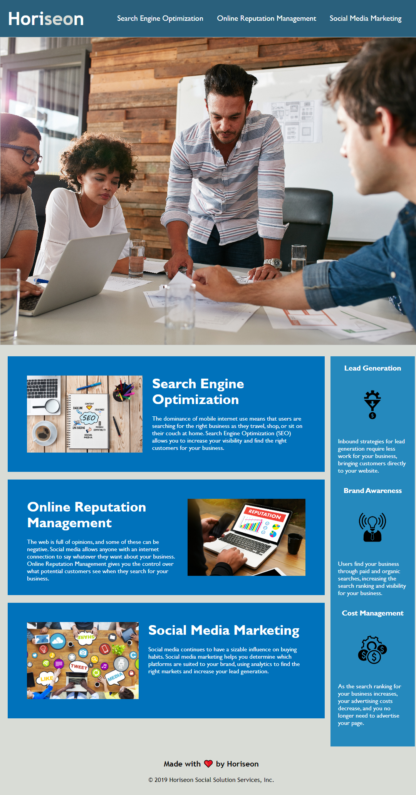

# Refactoring Horiseon webpage 

## Description

In this project, our objective is to improve the ***accessibility*** of our given page.

In order to do this we can use refactoring which refers to improving the codebase of the webpage without altering how the page looks or funtions. 

Industries use and consider the importance of such process as it ensures that people with disabilities can access the given site, through the use of tech applications such as - screen readers.

 
 

## Visual Representation of Horiseon webpage

## Installation
You download the file in your local machine and unzip the folder containing the original code in its un-sematic form. 
https://static.fullstack-bootcamp.com/uk-16/activities/01-html-git-github-module/04-code-refactor-lesson/challenge.zip  

 
 

## Deployed of Horiseon webpage
https://georgegio.github.io/horiseon-refactoring/  

## License
Copyright (c) Microsoft Corporation. All rights reserved.

Licensed under the [MIT](./LICENSE) license.

